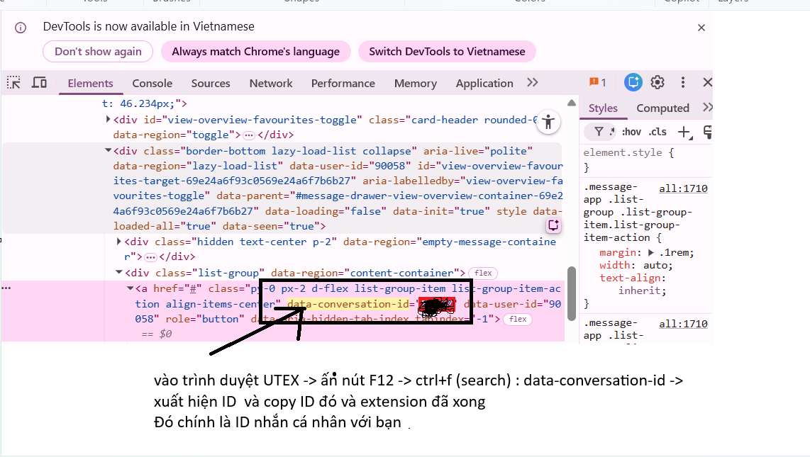

# Moodle Quote Sender

Extension Chrome giúp ẩn highlight khi bôi đen text và tự động gửi đoạn text đã chọn vào conversation Moodle.

## ✨ Tính năng

- 🎯 **Ẩn highlight tự động** - Khi bật extension, việc bôi đen text sẽ không hiển thị màu nền highlight
- 📤 **Gửi text tự động** - Đoạn text được chọn sẽ tự động gửi vào conversation Moodle sau 0.5 giây
- 💾 **Quản lý nhiều Conversation ID** - Lưu và chọn nhanh từ danh sách các conversation ID đã dùng
- 🔄 **Tự động lấy ID** - Extension tự động thu thập và lưu conversation ID từ response của server
- 🎨 **Giao diện thân thiện** - Popup hiện đại với dark theme

## 📦 Cài đặt

### Cách 1: Cài đặt từ Chrome Web Store (Đang chờ publish)
1. Truy cập Chrome Web Store
2. Tìm kiếm "Moodle Quote Sender"
3. Click "Add to Chrome"

### Cách 2: Cài đặt thủ công (Developer Mode)
1. Tải source code về máy
2. Mở Chrome và truy cập `chrome://extensions/`
3. Bật "Developer mode" ở góc trên bên phải
4. Click "Load unpacked"
5. Chọn thư mục chứa source code extension

## 🚀 Hướng dẫn sử dụng

### Bước 1: Lấy Conversation ID

Có 3 cách để lấy Conversation ID:

#### Cách 1: Tự động từ trang (Khuyên dùng)
- Extension sẽ tự động phát hiện conversation ID khi bạn đang ở trang chat Moodle
- Không cần làm gì thêm!

#### Cách 2: Lấy từ DevTools (Xem hình `manual.png`)
1. Vào trang chat Moodle (UTEX LMS)
2. Mở DevTools (F12)
3. Chuyển sang tab **Elements**
4. Nhấn `Ctrl+F` để mở tìm kiếm
5. Tìm kiếm: `data-conversation-id`
6. Copy số ID xuất hiện (ví dụ: xxxxx)
7. Mở popup extension và paste ID vào ô input
8. Click "Lưu ID"


data-conversation-id
#### Cách 3: Nhập thủ công khi gửi
- Nếu extension không tìm thấy ID, sẽ hiện popup yêu cầu nhập
- Nhập ID và click "Lưu & gửi"

### Bước 2: Sử dụng extension

1. **Bật extension**: Mở popup và đảm bảo toggle ở trạng thái "Đang hoạt động"
2. **Chọn Conversation ID**: 
   - Chọn từ dropdown nếu đã có ID đã lưu
   - Hoặc nhập ID mới và click "Lưu ID"
3. **Gửi tin nhắn**:
   - Vào trang chat Moodle
   - Bôi đen đoạn text bạn muốn gửi
   - Đợi 0.5 giây, extension sẽ tự động gửi

### Quản lý Conversation IDs

- **Thêm ID mới**: Nhập vào ô input và click "Lưu ID"
- **Chọn ID**: Click vào dropdown và chọn ID muốn dùng
- **Xóa ID**: Chọn ID trong dropdown, sau đó click "Xóa ID đã chọn"
- **Tự động lưu**: Mỗi lần gửi tin thành công, ID sẽ tự động được lưu vào danh sách

## 🎮 Demo

### Popup Extension
```
┌─────────────────────────────────────┐
│  Moodle Quote Sender                │
│  ● Đang hoạt động            [ON]   │
├─────────────────────────────────────┤
│  Chọn Conversation ID               │
│  [-- Chọn ID đã lưu --        ▼]    │
│                                     │
│  Hoặc nhập ID mới                   │
│  [xxxxx                        ]    │
│  [Lưu ID] [Xóa ID đã chọn]         │
│  ✓ Đang dùng Conversation ID: xxxxx │
└─────────────────────────────────────┘
```

## 🔧 Cấu hình

Extension hoạt động với:
- **Domain**: `https://utexlms.hcmute.edu.vn/*`
- **Permissions**: 
  - `activeTab` - Truy cập tab hiện tại
  - `scripting` - Inject scripts
  - `storage` - Lưu settings và conversation IDs

## 📝 Lưu ý

- Extension chỉ hoạt động trên domain `utexlms.hcmute.edu.vn`
- Cần có sesskey hợp lệ (tự động lấy từ trang)
- Conversation ID phải là số dương
- Tin nhắn chỉ được gửi khi extension ở trạng thái "Đang hoạt động"

## 🐛 Troubleshooting

### Extension không gửi được tin nhắn
- Kiểm tra xem đã bật extension chưa (toggle phải ở trạng thái ON)
- Đảm bảo đang ở đúng trang chat Moodle
- Kiểm tra Conversation ID có đúng không
- Mở Console (F12) để xem log lỗi

### Không tìm thấy sesskey
- Refresh lại trang Moodle
- Đảm bảo đã đăng nhập vào hệ thống
- Thử logout và login lại

### ID không được lưu tự động
- Kiểm tra Console để xem response từ server
- Có thể cần nhập ID thủ công lần đầu
- Sau khi gửi thành công, ID sẽ được lưu

## 📄 License

MIT License - Tự do sử dụng và chỉnh sửa

## 👨‍💻 Phát triển

### Cấu trúc thư mục
```
moodle-quote-sender/
├── manifest.json          # Cấu hình extension
├── popup.html            # Giao diện popup
├── popup.js              # Logic popup
├── content-script.js     # Script chạy trên trang Moodle
├── content.css           # CSS ẩn highlight
├── background.js         # Service worker
├── icon16.png           # Icon 16x16
├── icon48.png           # Icon 48x48
├── icon128.png          # Icon 128x128
├── manual.png           # Hình hướng dẫn
└── README.md            # File này
```

### Công nghệ sử dụng
- Manifest V3
- Vanilla JavaScript
- Chrome Extension APIs
- Moodle AJAX API

## 📞 Liên hệ

Nếu có vấn đề hoặc góp ý, vui lòng tạo issue trên GitHub repository.

---

**Version**: 1.1.0  
**Last Updated**: 2024
